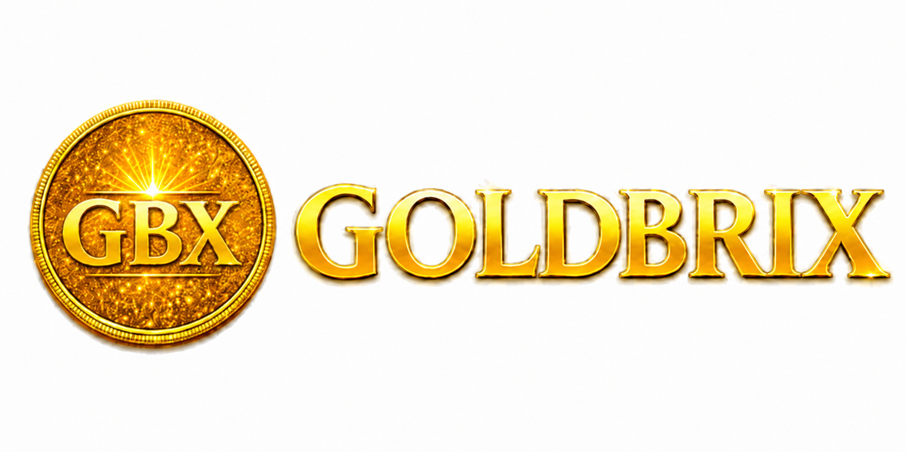
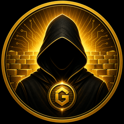

  

<h1 align="center">GoldBrix (GBX)</h1>

  <b>Real chain. Real burn. Real fairness.</b> 
  An autonomous, ownerless Proof-of-Work network with a built-in token launchpad. 
  No company. No CEO. No admin key. The rules live in code and consensus.

  
  
  
  

---

## Get GoldBrix

- **Web app:** [goldbrix.app](https://goldbrix.app) — create a wallet, buy/sell GBX (non-custodial)
- **Android APK:** [downloads](https://goldbrix.app/downloads/) — verify SHA-256 against [version.json](https://goldbrix.app/version.json)
- **Explorer:** [explorer.goldbrix.app](https://explorer.goldbrix.app)
- **Mine (0 fee, non-custodial):** `stratum+tcp://goldbrix.app:3333` — [guide](https://github.com/GOLDBRIX-GBX/goldbrix-tools/blob/main/docs/MINING.md) · live stats: [/pool-info](https://goldbrix.app/pool-info)
- **Run a node:** [guide](https://goldbrix.app/run-node) · release checksums: [SHA256SUMS](https://goldbrix.app/downloads/SHA256SUMS-v30-gbx-7.txt)

## Why GoldBrix

Almost every token launch ends the same way: insiders pump, outsiders buy, then
the team pulls the liquidity and walks. GoldBrix is built so that cannot happen —
not because anyone promises it, but because **no one holds the keys to do it.**

There is no founder allocation, no presale, no admin switch. The network belongs
to the people who mine it and hold it. Honesty is enforced by code, not by trust.

## What makes it different

| | Typical project | GoldBrix |
|---|---|---|
| Ownership | Team / company | **No owner, no CEO** |
| Admin key | Yes (can mint, pause, drain) | **None** |
| Launch | Premine / presale to insiders | **Fair PoW from genesis** |
| Fees | Paid to the team | **100% burned** |
| Rug pull | Team removes liquidity | **Liquidity protocol-owned, locked by code — no withdraw function** |
| Survival | Dies if team leaves | **Runs autonomously, self-heals** |

## Core properties

- **Proof-of-Work (SHA-256d)** with a hard cap of **15,000,000 GBX**.
- **Dual-phase emission:** a bootstrap phase of 50 GBX per 10-minute block up to
  block 20,000, then a production phase with 3-second blocks (LWMA-3 difficulty)
  and a 0.25 GBX subsidy, halving every 28,000,000 blocks.
- **Fair launch:** open, permissionless mining since genesis — anyone can mine.
  No premine, no presale. Coins exist only by mining or by buying through the
  app/web, and every balance is transparent and verifiable on-chain.
- **Anti-51% finality:** chain reorganizations beyond a fixed depth are rejected
  by consensus, hardening the network against majority attacks — with no trusted
  signer.

## The token launchpad

Anyone can create a community token. The mechanics are designed to be fair and
spam-resistant by construction:

- **Creating a token is free.** The creator must only make the first buy, with a
  small minimum, to prevent spam and bot-flooding.
- **Every fee is burned — 100%.** Create, buy, sell, promote: each action burns
  GBX to a provably unspendable address. No fee ever reaches a person.
- **Burn-driven scarcity:** every trade permanently reduces supply, so activity
  compounds value for all holders instead of paying an operator.
- **Automatic graduation:** once a token reaches its bonding-curve threshold it
  graduates to an AMM. Its liquidity is **protocol-owned and locked by code** —
  no withdraw function exists, and every fee it earns is burned. At handover,
  pool custody moves into keyless on-chain constructions (see The endgame),
  making the lock permanent and verifiable by anyone.

> Your fees aren't someone's salary. Your activity burns supply.

## Autonomous by design

- **Runs without an operator.** Services self-heal and restart automatically.
- **No single point of failure.** Redundant nodes and mining.
- **Treasury protected by code:** circuit breakers, hard per-transaction and
  daily limits, and automatic stop on anomaly — defending against whales and
  dumps without any human intervention.
- **Idempotent by construction:** payments never double-send and never get lost.

The test for every feature: *does it keep running if the founder disappears
tomorrow?* If not, it is not ready.

## The endgame: no key

GoldBrix is designed to end without an owner. Economic rules — supply, fees,
graduation — are fixed in code. At handover, treasury and liquidity controls
move into keyless constructions and the founding keys are **destroyed, not
transferred**, so no person — including the creator — can ever change the supply,
redirect fees, or drain funds.

## The Founder

  

GoldBrix was laid down, brick by brick, by an anonymous builder known only as
**Gideon Brick** — who then stepped away. His absence is the design: a network
with no one to capture, pressure, or buy off. He mined as a
peer among peers, took no special share, and asked nothing in return. The name is
a marker, not a master.

> *"He laid the foundation, then walked away — and kept no key."*

## Build and verification

GoldBrix Core builds with CMake. Reproducible builds are produced with GNU Guix
(see `contrib/guix`), and published checksums (`SHA256SUMS`) accompany each
release — so anyone can independently rebuild from this source and verify the
running binary matches, byte for byte.

## License

Released under the MIT License. See [COPYING](COPYING).
